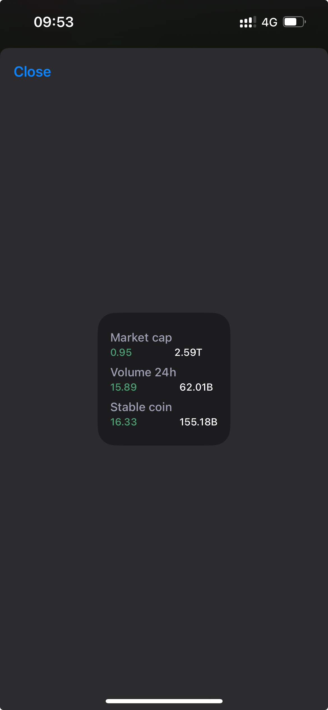

### Coin Global Market Widget on iOS using [Scriptable](https://docs.scriptable.app/)

A widget for displaying global cryptocurrency market data using the CoinMarketCap API. The widget provides information about the total market capitalization, 24-hour volume, and stablecoin market data, with changes represented in both absolute values and percentage changes.

### Features

- Fetches global cryptocurrency market data form Coinmarketcap
- Displays total market capitalization, 24-hour trading volume, and stablecoin market capitalization.
- Shows percentage changes for the market cap and volume over the past 24 hours.
- Supports dark theme.
- Formats large numbers into readable formats (e.g., millions, billions).



### Code

```js
async function fetchGlobalMarket() {
  try {
    let request = new Request(
      "https://web-api.coinmarketcap.com/v1/global-metrics/quotes/latest"
    );
    let response = await request.loadJSON();
    let data = response?.data?.quote?.USD;
    return {
      stablecoin_market_cap: data.stablecoin_market_cap,
      stablecoin_24h_percentage_change: data.stablecoin_24h_percentage_change,
      total_market_cap: data.total_market_cap,
      total_market_cap_yesterday_percentage_change:
        data.total_market_cap_yesterday_percentage_change,
      total_volume_24h: data.total_volume_24h,
      total_volume_24h_yesterday_percentage_change:
        data.total_volume_24h_yesterday_percentage_change,
    };
  } catch (error) {
    console.error("fetchGlobalMarket:", error);

    return {
      total_market_cap: 0,
      total_market_cap_yesterday_percentage_change: 0,
      total_volume_24h: 0,
      total_volume_24h_yesterday_percentage_change: 0,
    };
  }
}

function getColorPercent(val) {
  return val >= 0 ? "#4DA174" : "#D24949";
}

const params = args.widgetParameter ? args.widgetParameter.split(",") : [];
const isDarkTheme = params?.[0] === "dark";
const padding = 2;

function randomColor() {
  var randomColor = Math.floor(Math.random() * 16777215).toString(16);
  return `#${randomColor}`;
}

function addLine(widget, text, price, percent, grow) {
  const rowStack = widget.addStack();
  rowStack.setPadding(padding, padding, padding, padding);
  rowStack.layoutVertically();
  // rowStack.backgroundColor = new Color(randomColor());

  //title
  const titleStack = rowStack.addStack();
  titleStack.setPadding(padding, 0, 0, 0);
  const titleText = titleStack.addText(text);
  titleText.leftAlignText();
  titleText.font = Font.mediumSystemFont(14);
  titleText.textColor = new Color("#9CA0B2");

  //value
  const valueStack = rowStack.addStack();
  valueStack.layoutHorizontally();
  valueStack.setPadding(padding, 0, 0, 0);

  const percentStack = valueStack.addStack();
  const percentText = percentStack.addText(percent);
  percentText.leftAlignText();
  percentText.font = Font.mediumSystemFont(12);
  percentText.textColor = new Color(grow);

  const priceStack = valueStack.addStack();
  priceStack.addSpacer(50);
  const priceText = priceStack.addText(price);
  priceText.rightAlignText();
  priceText.font = Font.mediumSystemFont(12);

  widget.addSpacer(2);
}

//This function from ChatGPT
function formatNumber(number) {
  let unit;
  let value;
  if (number >= 1e12) {
    unit = "T"; // Trillion
    value = (number / 1e12).toFixed(2);
  } else if (number >= 1e9) {
    unit = "B"; // Billion
    value = (number / 1e9).toFixed(2);
  } else if (number >= 1e6) {
    unit = "M"; // Million
    value = (number / 1e6).toFixed(2);
  } else if (number >= 1e3) {
    unit = "K"; // Thousand
    value = (number / 1e3).toFixed(2);
  } else {
    unit = ""; // No unit
    value = number.toFixed(2);
  }

  const [integer, decimal] = value.split(".");
  const formattedInteger = integer.replace(/(\d)(?=(\d{3})+(?!\d))/g, "$1,");

  const formattedNumber = formattedInteger + "." + decimal + unit;
  return formattedNumber;
}

async function main() {
  const globalMarket = await fetchGlobalMarket();

  let {
    total_market_cap,
    total_market_cap_yesterday_percentage_change,
    total_volume_24h,
    total_volume_24h_yesterday_percentage_change,
    stablecoin_market_cap,
    stablecoin_24h_percentage_change,
  } = globalMarket;

  let widget = new ListWidget();
  if (isDarkTheme) {
    widget.backgroundColor = new Color("#1C1C1E");
  }
  widget.setPadding(padding, padding, padding, padding);

  addLine(
    widget,
    "Market cap",
    `${formatNumber(Number(total_market_cap))}`,
    `${Number(total_market_cap_yesterday_percentage_change).toFixed(2)}`,
    getColorPercent(total_market_cap_yesterday_percentage_change)
  );

  addLine(
    widget,
    "Volume 24h",
    `${formatNumber(Number(total_volume_24h))}`,
    `${Number(total_volume_24h_yesterday_percentage_change).toFixed(2)}`,
    getColorPercent(total_volume_24h_yesterday_percentage_change)
  );

  addLine(
    widget,
    "Stable coin",
    `${formatNumber(Number(stablecoin_market_cap))}`,
    `${Number(stablecoin_24h_percentage_change).toFixed(2)}`,
    getColorPercent(stablecoin_24h_percentage_change)
  );

  Script.setWidget(widget);
  Script.complete();
  widget.presentSmall();
}

main();
```
